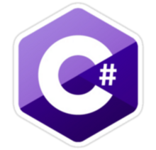

# DesktopClient 💻

📎**The project is designed for college**.

## ⚙ Programming Languages:
### C#

## ⚙ Frameworks:
### MAUI

## 📋 Description 

📎I am implementing a small http server in this project. To process descktop aplication requests. The http server in the project is referred to as **"DescktopEngine"**. It's own middleware has been developed for the http server.

## ⚙ Used Libraries  

#### 🔩 System.Net.Http
#### 🔩 Newtonsoft.Json
